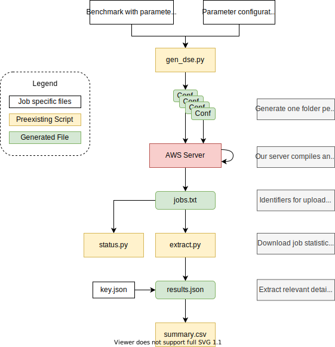

# Dahlia Evaluation

Evaluation for "[Predictable Accelerator Design with Time-Sensitive Affine types][dahlia-paper]"
using the [Dahlia programming language][dahlia].

There are three components to the Evaluation:

- [The Dahlia Compiler][dahlia]: A compiler from Dahlia to Vivado HLS C.
- [Polyphemus Server][poly]: A server-client system for orchestrating large scale FPGA experiments.
- Benchmarks (this repository).

[dahlia]: https://github.com/cucapra/dahlia
[dahlia-paper]: https://rachitnigam.com/files/pubs/dahlia.pdf
[poly]: https://github.com/cucapra/polyphemus/

### Prerequisites

1. Python 3
2. Install JupyterLab with `pip install jupyter`.
3. Install python dependencies with `pip install -r requirements.txt`
4. Install local benchmarking helpers with `cd benchmarking-helpers && pip install -e .`

## Artifact Evaluation

### Getting Started Guide

- Download the artifact VM Image. **TODO: Add link to artifact**
- Boot the image in your favorite Hypervisor (Image tested on VirtualBox).
- **TODO: Run Dahlia compiler on few configurations**.
- **TODO: Open link to Cerberus**.

### Step-by-step Guide

For artifact evaluation, we would like reviewers to go through the following
steps:

- Configurations accepted by Dahlia
  - Exhaustive DSE: % of configurations accepted by Dahlia.
  - Qualitative Studies: % of configurations accepted by Dahlia.

- Experimental data and graph generation
  - Regenerate all graphs in the paper using the `main-figures.ipynb` script.
  - (*Optional*) Open the ipython notebook and read the explanation for all the experiments.
  - (*Optional*) Visually inspect the collected data in the repository.

- Data Collection example
  - Try out the scaled down data collection example with Polyphemus.
  - (*Optional*) Read the documentation on setting up Polyphemus on AWS. **TODO: Missing**.
  - (*Optional*) Read the documentation on setting up a new experiment with Polyphemus.

- (*Optional*) Evaluating the Dahlia Compiler
  - (*Optional*) Rebuild the compiler.
  - (*Optional*) Run the examples and check the error messages generated by the compiler.
  - (*Optional*) Checkout the documentation on the language. **TODO: Requires cleanup**
  - (*Optional*) Checkout the documentation on extending the compiler. **TODO: Missing**

#### Configurations accepted by Dahlia

In this section, we will reproduce the following claims:

*Section 5.2*
> Dahlia accepts 354 configurations, or about 1.1% of the unrestricted design space.

*Section 5.3 (stencil2d)*
> The resulting design space has 2,916 points. Dahlia accepts 18 of these points (0.6%).

*Section 5.3 (md-knn)*
> The full space has 16,384 points, of which Dahlia accepts 525 (3%).

*Section 5.3 (md-grid)*
> The full space has 21,952 points, of which Dahlia accepts 81 (0.4%)

**TODO: Add script to automate this.**

Each claim has two parts: (1) Number of configurations in the design space, and
(2) number of configurations accepted by Dahlia.

For each benchmark, our script generates *k* directories where *k* is the number
of configurations. It then runs the Dahlia compiler on each of the files and
reports if the configuration was accepted or not.

**TODO: Add script for each benchmark that will the Dahlia accepted
configurations**

#### Figures and Pareto points

In this section, we reproduce all the graphs in the paper **from data already
committed to the repository**. Since the data collection step requires access
to proprietary compilers, we address data collection in the next section.

- In the `dahlia-evaluation/` directory, run `jupyter notebook`.
- Click on `main.ipynb`.
- Click on the "Restart the kernel and re-run the whole notebook" button (⏩️).
- All the graphs will be generated within the notebook under the corresponding
  section.

**Note:** The color and the background on the graphs might look different but
the points and the labels are correct.

<b>Information on saved data:</b> [click to expand]
We optionally invite the reviewers to look at our collected data. This section
describe where all the saved data is.

**Sensitivity analysis** (`sensitivity-analysis/`)

The sensitivity analysis consists of three experiments:

1. Fig. 4a: Unrolling the innermost loop without any partitioning (`sensitivity-analysis/no-partition-unoll/summary.csv`).
2. Fig. 4b: Unrolling with a constant partitioning (`sensitivity-analysis/const-partition-unroll/summary.csv`)
3. Fig. 4c: Unrolling and partitioning in lockstep (`sensitivity-analysis/lockstep-partition-and-unroll/summary.csv`).

**Exhaustive DSE** (`exhaustive-dse/data/`)

The exhaustive design space exploration study uses a single experiment with
32,000 distinct configurations to generate the three subgraphs in Figure 7.

**Qualitative study** (`qualitative-study/data/`)

The qualitative study consists of three benchmarks:

1. stencil2d (`qualitative-study/stencil2d`).
2. md-knn (`qualitative-study/md-knn`).
3. md-grid (`qualitative-study/md-grid`).

**Spatial** (`spatial-sweep/data/`)

The Spatial study consists of one experiment with several configurations to
generate Figure 9 (main paper) and Figure 2 (supplementary text).

#### Data Collection

Each figure reported in the paper requires data from different sources.

1. Sensitivity analysis (fig. 4): This benchmark synthesizes
   the hardware design in AWS F1 and runs it on an FPGA. It requires access
   to Vivado HLS tools and an FPGA.

2. Exhaustive DSE (fig. 7) & Qualitative Studies (fig. 8): These benchmarks
   run estimation on the FPGA designs without any synthesis. They require access
   to Vivado HLS tools.

3. Spatial Comparison (fig. 8): This experiment generates post-synthesis
   resource summaries for several parameter configurations with Spatial
   designs. For our submission, we were only able to get the Spatial workflow
   running on our research server (non-AWS).

In this section we **do not** reproduce the data reported in the paper. We
instead provide a smaller example to demonstrate that our distributed FPGA
experimentation framework is functional and provide descriptions to reproduce
our original results.

Each experiment goes through the following flow:

  

<b>Example Configuration</b> [click to expand]

`gen_dse.py` is a search and replace script that generates folders for each
possible configuration.

When invoked on a folder, it looks for a `template.json` file that maps
paramters in files to possible values. For example, the following in
files in a folder named `bench`:

<table>
<tr> <th> bench.cpp </th> <th> template.json </th> </tr>
<tr>
<td>
<pre>
int x = ::CONST1::;
int y = ::CONST2::;
x + y;
</pre>
</td>
<td>
<pre>
{
  "bench.cpp": {
    "CONST1": [1, 2, 3],
    "CONST2": [1, 2, 3]
  }
}
</pre>
</td>
</tr>
</table>

`gen_dse.py` will generate 9 configurations in total by iterating over the
possible values of `CONST1` and `CONST2`.

----------------

### Benchmarking Scripts

The infrastructure for running benchmarks is under the `_scripts` directory.

For these scripts, you can set a `BUILDBOT` environment variable to point to
the URL of the running Buildbot instance.

<b>batch.py</b> [click to expand]

Submit a batch of benchmark jobs to the Buildbot.

Each argument to the script should be the path to a specific benchmark version in this repository, like `baseline/machsuite-gemm-ncubed`.
Use it like this:

    ./_scripts/batch.py <benchpath1> <benchpath2> ...

The script creates a new directory for the batch under `_results/` named with a timestamp.
It puts a list of job IDs in a file called `jobs.txt` there.
It prints the name of the batch directory (i.e., the timestamp) to stdout.

This script has command-line options:

- `-E`: Submit jobs for full synthesis. (The default is to just do estimation.)
- `-p`: Pretend to submit jobs, but don't actually submit anything. (For debugging.)

<b>extract.py</b> [click to expand]

Download results for a previously-submitted batch of benchmark jobs.

On the command line, give the path to the batch directory.
Like this:

    ./_scripts/extract.py _results/2019-07-13-17-13-09

The script downloads information about jobs from `jobs.txt` in that directory.
It saves lots of extracted result values for the batch in a file called `results.json` there.

<b>summarize.py</b> [click to expand]

Given some extracted data for a batch, summarize the results in a human-friendly CSV.

Give the script the path to a `results.json`, like this:

    ./_scripts/summarize.py _results/2019-07-13-17-13-09/results.json

The script produces a file in the same directory called `summary.csv` with particularly relevant information pulled out.

<b>status.py</b> [click to expand]

Get the current status of a batch while you impatiently wait for jobs to complete.
Print out the number of jobs in each state.

Give the script the path to a batch directory:

    ./_scripts/status.py _results/2019-07-13-17-13-09

Use the [watch](https://linux.die.net/man/1/watch) command to repeatedly run
the command every 5 seconds

    watch -n5 ./_scripts/status.py _results/2019-07-13-17-13-09

### Contact

Please open an issue or email [Rachit Nigam](mailto:rnigam@cs.cornell.edu).
